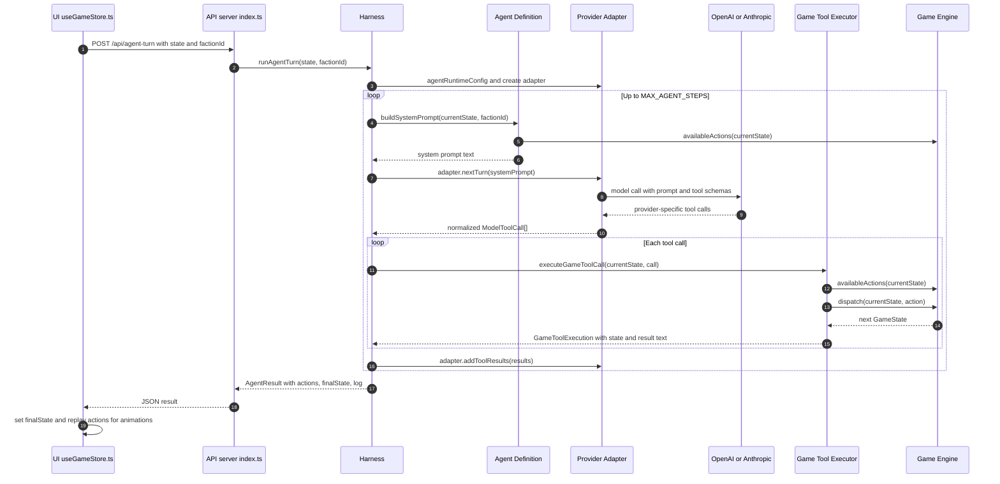

# LLM Harness Flow

This is the current path for `AI: Take Turn`.

For the most readable version in VS Code or a browser, open:

[`docs/llm-harness-flow.svg`](llm-harness-flow.svg)



Plain-text fallback:

```text
UI useGameStore.ts
  -> API server/index.ts
  -> Harness server/agent/harness.ts
  -> Agent Definition server/agent/factionAgent.ts
      asks Game Engine for availableActions
      builds the prompt
  -> Provider Adapter server/agent/provider.ts
      sends prompt + tool schemas to OpenAI or Anthropic
      normalizes provider-specific tool calls
  -> Game Tool Executor server/agent/gameTools.ts
      parses the tool call
      checks availableActions
      dispatches only legal actions through the game engine
  -> Harness sends tool results back to provider
  -> repeats until end_turn or max steps
  -> API returns actions, finalState, log
  -> UI applies finalState and replays animations
```

## Responsibility Map

| File | Responsibility |
|---|---|
| `src/store/useGameStore.ts` | Client-side trigger. Sends the current game state to the local API and applies the returned final state. |
| `server/index.ts` | HTTP boundary. Validates request shape and provider key, then calls `runAgentTurn`. |
| `server/agent/harness.ts` | Main loop. Builds prompts, asks provider for tool calls, executes them, feeds results back, and ends the turn. |
| `server/agent/factionAgent.ts` | Agent definition. Tool schemas plus the faction briefing/system prompt. |
| `server/agent/provider.ts` | Provider adapter. Converts OpenAI/Anthropic-specific responses into normalized `ModelToolCall` objects. |
| `server/agent/gameTools.ts` | Safety boundary. Parses model tool calls, checks legality with `availableActions`, and mutates state only through `dispatch`. |
| `server/agent/types.ts` | Shared contracts between the harness, provider adapters, and tool executor. |
| `src/game/engine.ts` | Source of truth for legal actions and state transitions. |

## Key Rule

The model never changes game state directly. It only requests tools. The harness sends those requests to `gameTools.ts`, and `gameTools.ts` only changes state through the game engine after the action passes `availableActions`.
